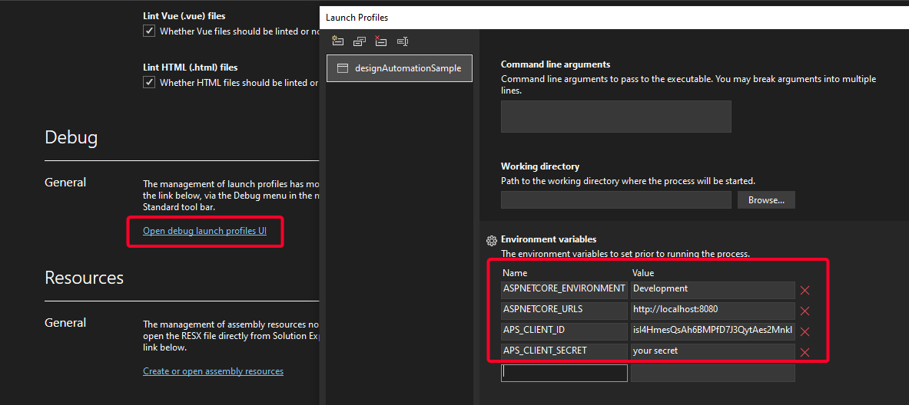

# APS Design Automation Tutorial .NET 6


[](http://opensource.org/licenses/MIT)

[](http://developer.autodesk.com/)
[](http://developer.autodesk.com/)
[](http://developer.autodesk.com/)


# Description

Webapp interface that uses Design Automation to update the `width` and `height` param of DWG Dynamic Block (using AutoCAD), RVT Window Family instance (using Revit), IPT Part parameters (using Inventor) and 3DS ... (using 3dsMax). Also includes a `Clear Account` (remove all AppBundles and Activities) and `Define new Activity` based on the sample code. Uses ASP.NET Core SignalR to update the interface.

See other projects for bundles.

## Thumbnail

https://user-images.githubusercontent.com/6602398/204210930-b4c11bb9-6d95-4e5f-88d5-4bda00f7a090.mp4

# Setup

## Prerequisites

1. **APS Account**: Learn how to create a APS Account, activate subscription and create an app at [this tutorial](https://tutorials.autodesk.io/#create-an-account). 
2. **Visual Studio**: Either Community (Windows) or Code (Windows, MacOS).
3. **.NET Core** basic knowledge with C#

## Running locally

Clone this project or download it. It's recommended to install [GitHub desktop](https://desktop.github.com/). To clone it via command line, use the following (**Terminal** on MacOSX/Linux, **Git Shell** on Windows):

    git clone https://github.com/autodesk-platform-services/aps-design-automation-dotnet.git

**Visual Studio** (Windows):

Right-click on the project, then go to **Debug**. Adjust the settings as shown below. 



Right-click on the project, then `Add` ---> `New Item`, select `JSON` file and name it `appsettings.user.json` , this is a user settings files required by Design Automation sdk to make authentication and run various API requests.

```json
{
  "Forge": {
    "ClientId": "your APS_CLIENT_ID",
    "ClientSecret": "your APS_CLIENT_SECRET"
  }
}
```

**Visual Sutdio Code** (Windows, MacOS):

Open the `webapp` folder (only), at the bottom-right, select **Yes** and **Restore**. This restores the packages (e.g. Autodesk.Forge) and creates the launch.json file. See *Tips & Tricks* for .NET Core on MacOS.


At the `.vscode\launch.json`, find the env vars and add your APS Client ID, Secret and callback URL. Also define the `ASPNETCORE_URLS` variable. The end result should be as shown below:

```json
"env": {
    "ASPNETCORE_ENVIRONMENT": "Development",
    "ASPNETCORE_URLS" : "http://localhost:8080",
    "APS_CLIENT_ID": "your id here",
    "APS_CLIENT_SECRET": "your secret here" 
}
```

**How to use this sample**

Open `http://localhost:8080` to start the app, if first time, click on `Define Activity`, enter new `width` & `height` values, select the input file (use from **sample files** folder), select the `Activity` and, finally, `Start workitem`. 

# Further Reading

Documentation:

- [Design Automation v3](https://aps.autodesk.com/en/docs/design-automation/v3/developers_guide/overview/)
- [Data Management](https://aps.autodesk.com/en/docs/data/v2/reference/http/) used to store input and output files.

Other APIs:

- [.NET 6 SignalR](https://learn.microsoft.com/en-us/aspnet/core/tutorials/signalr?view=aspnetcore-6.0&tabs=visual-studio)

### Tips & Tricks

This sample uses .NET 6 and works fine on both Windows and MacOS, see [this tutorial for MacOS](https://github.com/augustogoncalves/dotnetcoreheroku). You still need Windows debug the AppBundle plugins.

### Troubleshooting

1. **error setting certificate verify locations** error: may happen on Windows, use the following: `git config --global http.sslverify "false"`

## License

This sample is licensed under the terms of the [MIT License](http://opensource.org/licenses/MIT). Please see the [LICENSE](LICENSE) file for full details.

## Written by

Autodesk APS [@AutodeskAPS](https://twitter.com/autodeskaps), [APS Partner Development](http://aps.autodesk.com)
